**查看docker教学视频，请点击 《狂神说java》: https://www.bilibili.com/video/BV1og4y1q7M4?p=1**      **记得投币三连呀~~**


> Docker学习

- Docker概述
- Docker安装
- Docker命令
  - 镜像命令
  - 容器命令
  - 操作命令
  - ......

- Docker镜像
- 容器数据卷
- DockerFile
- Docker网络原理
- Idea整合Docker
- Docker Compose
- Docker Swarm
- CI\CD Jenkins

# Docker概述

## Docker为什么会出现？

一款产品： 开发–上线 两套环境！应用环境，应用配置！

开发 — 运维。 问题：我在我的电脑上可以允许！版本更新，导致服务不可用！对于运维来说考验十分大？

环境配置是十分的麻烦，每一个及其都要部署环境(集群Redis、ES、Hadoop…) !费事费力。

发布一个项目( jar + (Redis MySQL JDK ES) ),项目能不能带上环境安装打包！

之前在服务器配置一个应用的环境 Redis MySQL JDK ES Hadoop 配置超麻烦了，不能够跨平台。

开发环境Windows，最后发布到Linux！


**传统：**开发jar，运维来做！

**现在：**开发打包部署上线，一套流程做完！


**安卓流程：**java — apk —发布（应用商店）一 张三使用apk一安装即可用！

**docker流程：** java-jar（环境）— 打包项目帯上环境（镜像）— ( Docker仓库：商店）—下载我们发布的镜像 —直接运行即可！

Docker给以上的问题，提出了解决方案！


Docker的思想来源于集装箱！

JRE —多个应用（端口冲突）—原来都是交叉的！

隔离：Docker核心思想！打包装箱！每个箱子都是相互隔离的。

Docker通过隔离机制可以将服务器利用到极致！


本质：所有的技术都是因为出现了一些问题，我们需要去解决，才去学习！

## Docker的历史

2010年，几个的年轻人，就在美国成立了一家公司 **dotcloud**

做一些pass的云计算服务！LXC（Linux Container容器）有关的容器技术！

Linux Container容器是一种内核虚拟化技术，可以提供轻量级的虚拟化，以便隔离进程和资源。

他们将自己的技术（容器化技术）命名就是 Docker

Docker刚刚延生的时候，没有引起行业的注意！dotCloud，就活不下去！

**开源**

2013年，Docker开源！

越来越多的人发现docker的优点！火了。Docker每个月都会更新一个版本！

2014年4月9日，Docker1.0发布！

docker为什么这么火？十分的轻巧！

在容器技术出来之前，我们都是使用虚拟机技术！

虚拟机：在window中装一个VMware，通过这个软件我们可以虚拟出来一台或者多台电脑！笨重！

虚拟机也属于虚拟化技术，Docker容器技术，也是一种虚拟化技术！

```shell
VMware : linux centos 原生镜像（一个电脑！） 隔离、需要开启多个虚拟机！ 几个G 几分钟
docker: 隔离，镜像（最核心的环境 4m + jdk + mysql）十分的小巧，运行镜像就可以了！小巧！ 几个M 秒级启动！
```

> 聊聊Docker

Docker基于Go语言开发的！开源项目！

docker官网：https://www.docker.com/


文档：https://docs.docker.com/ Docker的文档是超级详细的！

仓库：https://hub.docker.com/

## Docker能干嘛

> 之前的虚拟机技术

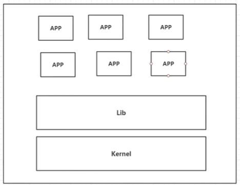

> 虚拟机技术缺点

1、 资源占用十分多

2、 冗余步骤多

3、 启动很慢！

> 容器技术

容器化技术不是模拟一个完整的操作系统

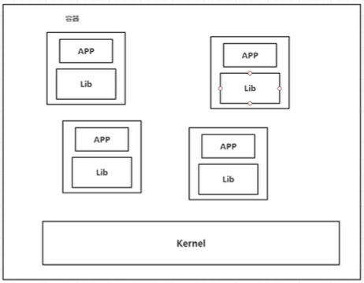

比较Docker和虚拟机技术的不同：

- 传统虚拟机，虚拟出一套容器内的应用直接运行在宿主机硬件，运行一个完整的操作系统，然后在这个系统上安装和运行软件
- 容器内的应用直接运行在宿主机内，容器是没有自己的内核的，也没有虚拟我们的硬件，所以就轻便了
- 每个容器间是相互隔离的，每个容器内都有一个属于自己的文件系统，互不影响

> DevOps (开发、运维)

**应用更快速的交付和部署**

传统：一堆帮助文档，安装程序

Docker：打包镜像发布测试，一键运行

**更便捷的升级和扩缩容**

使用了Docker之后，我们部署应用就和搭积木一样！

项目打包为一个镜像，扩展服务器A! 服务器B

**更简单的系统运维**

在容器化之后，我们的开发，测试环境都是高度一致的。

**更高效的计算资源利用**

Docker是内核级别的虚拟化，可以在一个物理机上运行很多个容器实例！服务器的性能可以被压榨到极致。

---


# Docker安装

## Docker的基本组成

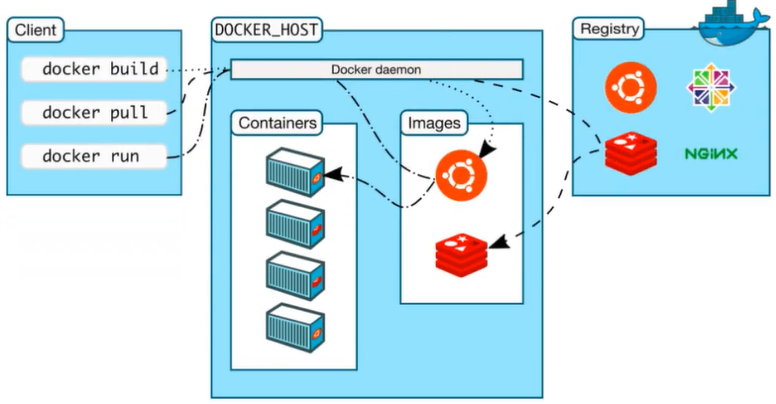

**镜像（image）：**

docker镜像就好比是一个目标，可以通过这个目标来创建容器服务，tomcat镜像==>run==>容器（提供服务器），通过这个镜像可以创建多个容器（最终服务运行或者项目运行就是在容器中的）。

**容器（container）:**

Docker利用容器技术，独立运行一个或者一组应用，通过镜像来创建的.

启动，停止，删除，基本命令

目前就可以把这个容器理解为就是一个简易的 Linux系统。

**仓库（repository）:**

仓库就是存放镜像的地方！

仓库分为公有仓库和私有仓库。(很类似git)

Docker Hub是国外的。

阿里云…都有容器服务器 (配置镜像加速!)

## 安装Docker

> 环境准备

1.Linux要求内核3.0以上

2.CentOS 7


> 环境查看

```shell
#系统内核要求3.0以上
[root@localhost ~]# uname -r
3.10.0-1062.el7.x86_64

#系统版本
[root@localhost ~]# cat /etc/os-release 
NAME="CentOS Linux"
VERSION="7 (Core)"
ID="centos"
ID_LIKE="rhel fedora"
VERSION_ID="7"
PRETTY_NAME="CentOS Linux 7 (Core)"
ANSI_COLOR="0;31"
CPE_NAME="cpe:/o:centos:centos:7"
HOME_URL="https://www.centos.org/"
BUG_REPORT_URL="https://bugs.centos.org/"

CENTOS_MANTISBT_PROJECT="CentOS-7"
CENTOS_MANTISBT_PROJECT_VERSION="7"
REDHAT_SUPPORT_PRODUCT="centos"
REDHAT_SUPPORT_PRODUCT_VERSION="7"

```


> 安装

帮助文档：

```shell
#1.卸载旧版本
 yum remove docker \
>                   docker-client \
>                   docker-client-latest \
>                   docker-common \
>                   docker-latest \
>                   docker-latest-logrotate \
>                   docker-logrotate \
>                   docker-engine

#2.需要的安装包
yum install -y yum-utils

#3.设置镜像的仓库
yum-config-manager \
    --add-repo \
    https://download.docker.com/linux/centos/docker-ce.repo
#上述方法默认是从国外的，不推荐

#推荐使用国内的
yum-config-manager \
    --add-repo \
    https://mirrors.aliyun.com/docker-ce/linux/centos/docker-ce.repo
  
#更新软件包索引
yum makecache fast

#4.安装docker docker-ce 社区版 而ee是企业版
yum install docker-ce docker-ce-cli containerd.io # 这里我们使用社区版即可

#5.启动docker
systemctl start docker

#6.使用docker version 查看是否安装成功
docker version
```

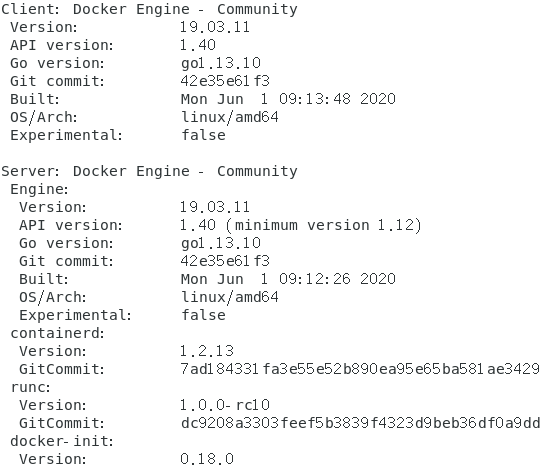

```shell
#7.测试
docker run hello-world
```

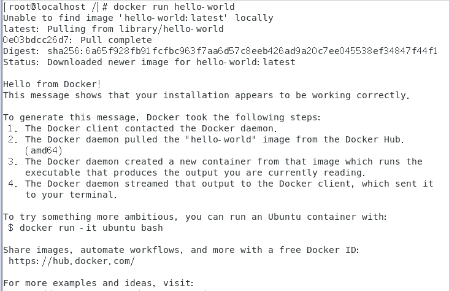

```shell
#8.查看一下下载的hello-world镜像
[root@localhost /]# docker images
REPOSITORY          TAG                 IMAGE ID            CREATED             SIZE
hello-world         latest              bf756fb1ae65        5 months ago        13.3kB

```

了解：卸载docker

```shell
#1.卸载依赖
yum remove docker-ce docker-ce-cli containerd.io

#2. 删除资源
rm -rf /var/lib/docker
# /var/lib/docker 是docker的默认工作路径！
```

阿里云镜像加速

**1、登录阿里云找到容器服务——>镜像加速器**

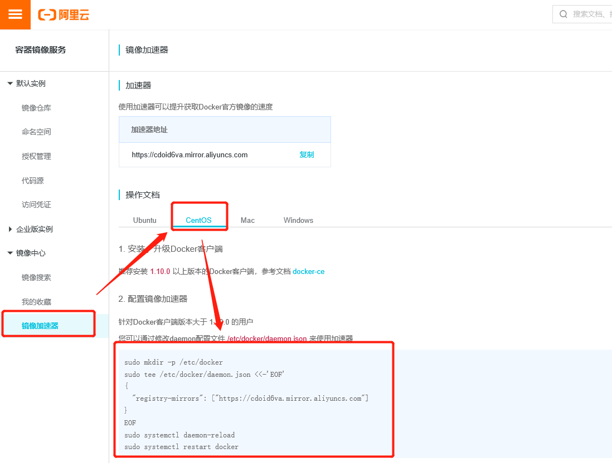

**2、配置使用**

```shell
sudo mkdir -p /etc/docker

sudo tee /etc/docker/daemon.json <<-'EOF'
{
  "registry-mirrors": ["https://cdoid6va.mirror.aliyuncs.com"]
}
EOF

sudo systemctl daemon-reload

sudo systemctl restart docker
```


## 回顾hello-world流程

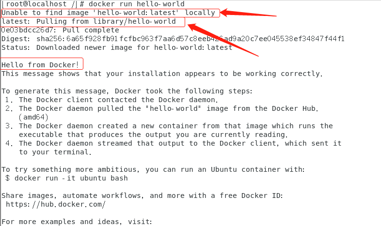

**docker run 流程图**

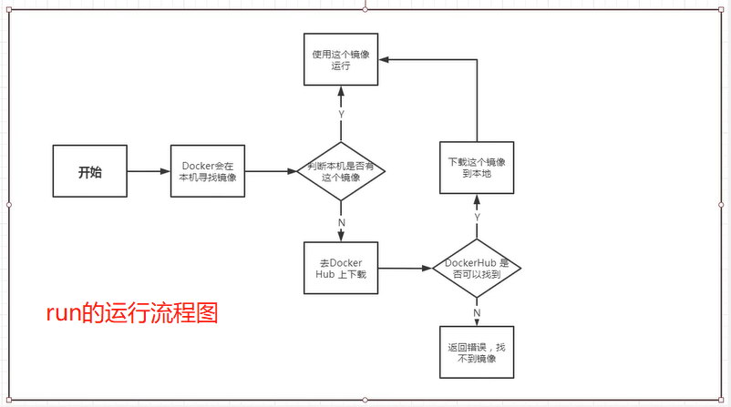

## 底层原理

**Docker是怎么工作的？**

Docker是一个Client-Server结构的系统，Docker的守护进程运行在宿主机上，通过Socket从客户端访问！

DockerServer接受到Docker-Client的指令，就会执行这个命令！

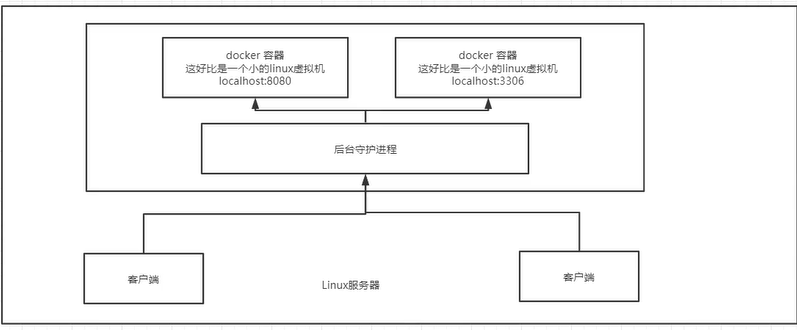

**Docker为什么比VM快？**

1、Docker有着比虚拟机更少的抽象层

2、Docker利用的是宿主机的内核，vm需要Guest Os。

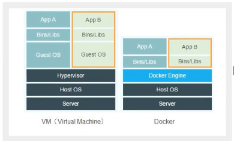

所以说，新建一个容器的时候，docker不需要像虚拟机一样重新加载一个操作系统内核，避免引导。虚拟机是加载Guest Os，分钟级别的，而docker是利用当前宿主机的操作系统，省略了复杂的过程，秒级的！


---


# Docker的常用命令

## 帮助命令

```shell
docker version     # 显示docker的版本信息
docker info        # 显示docker的系统信息，包括镜像和容器的数量
docker 命令 --help  # 帮助命令
```

帮助文档的地址：https://docs.docker.com/engine/reference/commandline/build/

## 镜像命令

**docker images**

```shell
[root@localhost /]# docker images
REPOSITORY          TAG                 IMAGE ID            CREATED             SIZE
hello-world         latest              bf756fb1ae65        5 months ago        13.3kB

#解释
REPOSITORY  镜像的仓库源
TAG         镜像标签
IMAGE ID    镜像id
CREATED     镜像的创建时间
SIZE        镜像的大小

#可选项
Options:
  -a, --all             # 列出所有镜像
  -q, --quiet           # 只显示镜像id

```

**docker search 搜索镜像**

```shell
[root@localhost /]# docker search mysql
NAME                              DESCRIPTION                                     STARS               OFFICIAL            AUTOMATED
mysql                             MySQL is a widely used, open-source relation…   9604                [OK]                
mariadb                           MariaDB is a community-developed fork of MyS…   3490                [OK]                

#可选项，通过收藏来过滤
--filter=STARS=3000  #搜索出来的镜像就是STARS大于3000的
[root@localhost /]# docker search mysql --filter=STARS=3000
NAME                DESCRIPTION                                     STARS               OFFICIAL            AUTOMATED
mysql               MySQL is a widely used, open-source relation…   9604                [OK]                
mariadb             MariaDB is a community-developed fork of MyS…   3490                [OK]                


```

**docker pull 下载镜像**

```shell
# 下载镜像 docker pull 镜像名[:tag]
[root@localhost /]# docker pull mysql
Using default tag: latest    # 如果不写 tag,默认就是latest
latest: Pulling from library/mysql
8559a31e96f4: Pull complete  # 分层下载，docker image的核心 联合文件系统
d51ce1c2e575: Pull complete 
c2344adc4858: Pull complete 
fcf3ceff18fc: Pull complete 
16da0c38dc5b: Pull complete 
b905d1797e97: Pull complete 
4b50d1c6b05c: Pull complete 
c75914a65ca2: Pull complete 
1ae8042bdd09: Pull complete 
453ac13c00a3: Pull complete 
9e680cd72f08: Pull complete 
a6b5dc864b6c: Pull complete 
Digest: sha256:8b7b328a7ff6de46ef96bcf83af048cb00a1c86282bfca0cb119c84568b4caf6 # 签名
Status: Downloaded newer image for mysql:latest
docker.io/library/mysql:latest  # 真实地址

docker pull mysql 等价于: docker pull docker.io/library/mysql:latest

# 指定版本下载
[root@localhost /]# docker pull mysql:5.7
5.7: Pulling from library/mysql
8559a31e96f4: Already exists   # 联合文件系统的好处：上面下载过的MySQL与5.7版本的MySQL有相同的文件时不需要重复下载
d51ce1c2e575: Already exists 
c2344adc4858: Already exists 
fcf3ceff18fc: Already exists 
16da0c38dc5b: Already exists 
b905d1797e97: Already exists 
4b50d1c6b05c: Already exists 
d85174a87144: Pull complete 
a4ad33703fa8: Pull complete 
f7a5433ce20d: Pull complete 
3dcd2a278b4a: Pull complete 
Digest: sha256:32f9d9a069f7a735e28fd44ea944d53c61f990ba71460c5c183e610854ca4854
Status: Downloaded newer image for mysql:5.7
docker.io/library/mysql:5.7

```


**docker rmi 删除镜像**

```shell
[root@localhost /]# docker rmi -f 镜像id  				 #删除指定镜像
[root@localhost /]# docker rmi -f 镜像id 镜像id 镜像id  	   #删除多个镜像
[root@localhost /]# docker rmi -f $(docker images -aq)     #删除全部镜像
```

## 容器命令

**说明：有了镜像才可以创建容器，linux,下载一个centos镜像来学习**

```shell
docker pull centos
```

**新建容器并启动**

```shell
docker run [可选参数] image

# 参数说明
--name="Name"	容器名字 tomcat01 tomcat02 ，用来区分容器
-d              后台方式运行
-it             使用交互方式运行，进入容器查看内容
-p              指定容器的端口 -p 8080:80
	-p  ip:主机(即宿主机)端口：容器端口
	-p  主机端口：容器端口  #这种方式常用
	-p  容器端口
	容器端口P
-P              随机指定端口(大写P)

# 测试，启动并进入容器
[root@localhost /]# docker run -it centos /bin/bash
[root@8b4c74381205 /]# ls     #查看容器内的centos,基础版本，很多命令都是不完善的！
bin  etc   lib	  lost+found  mnt  proc  run   srv  tmp  var
dev  home  lib64  media       opt  root  sbin  sys  usr

# 从容器中退回主机
[root@8b4c74381205 /]# exit
exit
[root@localhost /]# ls
123  bin   dev  home  lib64  mnt  proc  run   srv  tmp  var
222  boot  etc  lib   media  opt  root  sbin  sys  usr
```

**列出所有运行的容器**

```shell
# docker ps 命令
(不加） # 列出当前正在运行的容器
-a     # 列出当前正在运行的容器 + 带出历史运行过的容器
-n=?   # 显示最近创建的容器
-q    # 只显示当前容器的编号
[root@localhost /]# docker ps
CONTAINER ID        IMAGE               COMMAND             CREATED             STATUS              PORTS               NAMES
[root@localhost /]# docker ps -a
CONTAINER ID        IMAGE               COMMAND             CREATED             STATUS                          PORTS               NAMES
8b4c74381205        centos              "/bin/bash"         4 minutes ago       Exited (0) About a minute ago                       epic_wilson
fb87667bbc19        bf756fb1ae65        "/hello"            2 hours ago         Exited (0) 2 hours ago                              awesome_banach
[root@localhost /]# docker ps -a -n=1
CONTAINER ID        IMAGE               COMMAND             CREATED             STATUS                     PORTS               NAMES
8b4c74381205        centos              "/bin/bash"         9 minutes ago       Exited (0) 6 minutes ago                       epic_wilson
[root@localhost /]# docker ps -aq
8b4c74381205
fb87667bbc19
```

**退出容器**

```shell
exit   # 直接退出容器
Ctrl + p + q  # 容器不停止退出
```

**删除容器**

```shell
docker rm 容器id				   # 删除指定容器，不能删除正在运行的容器，如果要强制删除 rm -f
docker rm -f $(docker ps -aq)    # 删除所有容器 
docker ps -a -q|xargs docker rm  # 删除所有容器
```

**启动和停止容器的操作**

```shell
docker start 容器id     # 启动容器
docker restart 容器id   # 重启容器
docker stop 容器id      # 停止当前正在运行的容器
docker kill 容器id      # 强制停止当前正在运行的容器
```

## 常用其他命令

**后台启动容器**

```shell
# 命令 docker run -d 镜像名

[root@localhost /]# docker run -d centos
e9d60f206fa19963203db6c42c2f83c5120eb90eeee2b7ba9fdc4589370fd6b6
[root@localhost /]# docker ps
CONTAINER ID        IMAGE               COMMAND             CREATED             STATUS              PORTS               NAMES

# 问题docker ps,发现 centos 停止了

# 常见的坑，docker 容器使用后台运行，就必须要有一个前台进程，docker发现没有应用，就会自动停止
# nginx,容器启动后，发现自己没有提供服务，就会立刻停止，就是没有程序了
```

**查看日志**

```shell
docker logs -f -t --tail 数字 容器id

# 显示日志
-tf 	# 显示日志
--tail  # 要显示的日志条数
[root@localhost /]# docker logs -tf --tail 10 ce989f90023d 
```

**查看容器中进程信息**

```shell
# 命令 docker top 容器id
[root@localhost /]# docker top ce989f90023d
UID                 PID                 PPID                C                   STIME               TTY                 TIME     
root                12249               12232               0                   22:44               pts/0               00:00:00 
```

**查看镜像的元数据**

```shell
# 命令
docker inspect 容器id

# 测试
[root@localhost /]# docker inspect ce989f90023d
[
    {
        "Id": "ce989f90023dedc0b3f39c057b91f5c0b17180b3aef7aea0df8c93731e724244",
        "Created": "2020-06-10T14:44:45.025360147Z",
        "Path": "/bin/bash",
        "Args": [],
        "State": {
            "Status": "running",
            "Running": true,
            "Paused": false,
            "Restarting": false,
            "OOMKilled": false,
            "Dead": false,
            "Pid": 12249,
            "ExitCode": 0,
            "Error": "",
            "StartedAt": "2020-06-10T14:44:45.770227584Z",
            "FinishedAt": "0001-01-01T00:00:00Z"
        },
        "Image": "sha256:470671670cac686c7cf0081e0b37da2e9f4f768ddc5f6a26102ccd1c6954c1ee",
        "ResolvConfPath": "/var/lib/docker/containers/ce989f90023dedc0b3f39c057b91f5c0b17180b3aef7aea0df8c93731e724244/resolv.conf",
        "HostnamePath": "/var/lib/docker/containers/ce989f90023dedc0b3f39c057b91f5c0b17180b3aef7aea0df8c93731e724244/hostname",
        "HostsPath": "/var/lib/docker/containers/ce989f90023dedc0b3f39c057b91f5c0b17180b3aef7aea0df8c93731e724244/hosts",
        "LogPath": "/var/lib/docker/containers/ce989f90023dedc0b3f39c057b91f5c0b17180b3aef7aea0df8c93731e724244/ce989f90023dedc0b3f39c057b91f5c0b17180b3aef7aea0df8c93731e724244-json.log",
        "Name": "/nifty_johnson",
        "RestartCount": 0,
        "Driver": "overlay2",
        "Platform": "linux",
        "MountLabel": "",
        "ProcessLabel": "",
        "AppArmorProfile": "",
        "ExecIDs": null,
        "HostConfig": {
            "Binds": null,
            "ContainerIDFile": "",
            "LogConfig": {
                "Type": "json-file",
                "Config": {}
            },
            "NetworkMode": "default",
            "PortBindings": {},
            "RestartPolicy": {
                "Name": "no",
                "MaximumRetryCount": 0
            },
            "AutoRemove": false,
            "VolumeDriver": "",
            "VolumesFrom": null,
            "CapAdd": null,
            "CapDrop": null,
            "Capabilities": null,
            "Dns": [],
            "DnsOptions": [],
            "DnsSearch": [],
            "ExtraHosts": null,
            "GroupAdd": null,
            "IpcMode": "private",
            "Cgroup": "",
            "Links": null,
            "OomScoreAdj": 0,
            "PidMode": "",
            "Privileged": false,
            "PublishAllPorts": false,
            "ReadonlyRootfs": false,
            "SecurityOpt": null,
            "UTSMode": "",
            "UsernsMode": "",
            "ShmSize": 67108864,
            "Runtime": "runc",
            "ConsoleSize": [
                0,
                0
            ],
            "Isolation": "",
            "CpuShares": 0,
            "Memory": 0,
            "NanoCpus": 0,
            "CgroupParent": "",
            "BlkioWeight": 0,
            "BlkioWeightDevice": [],
            "BlkioDeviceReadBps": null,
            "BlkioDeviceWriteBps": null,
            "BlkioDeviceReadIOps": null,
            "BlkioDeviceWriteIOps": null,
            "CpuPeriod": 0,
            "CpuQuota": 0,
            "CpuRealtimePeriod": 0,
            "CpuRealtimeRuntime": 0,
            "CpusetCpus": "",
            "CpusetMems": "",
            "Devices": [],
            "DeviceCgroupRules": null,
            "DeviceRequests": null,
            "KernelMemory": 0,
            "KernelMemoryTCP": 0,
            "MemoryReservation": 0,
            "MemorySwap": 0,
            "MemorySwappiness": null,
            "OomKillDisable": false,
            "PidsLimit": null,
            "Ulimits": null,
            "CpuCount": 0,
            "CpuPercent": 0,
            "IOMaximumIOps": 0,
            "IOMaximumBandwidth": 0,
            "MaskedPaths": [
                "/proc/asound",
                "/proc/acpi",
                "/proc/kcore",
                "/proc/keys",
                "/proc/latency_stats",
                "/proc/timer_list",
                "/proc/timer_stats",
                "/proc/sched_debug",
                "/proc/scsi",
                "/sys/firmware"
            ],
            "ReadonlyPaths": [
                "/proc/bus",
                "/proc/fs",
                "/proc/irq",
                "/proc/sys",
                "/proc/sysrq-trigger"
            ]
        },
        "GraphDriver": {
            "Data": {
                "LowerDir": "/var/lib/docker/overlay2/bce8b2400427de29dd406d54ec08b3c07dc95530e80d37977a156ca971b37641-init/diff:/var/lib/docker/overlay2/d4cd3bedb1e7340e62bb292c1e0d5ae37b1d1689ffc1640da67b2a8325facc21/diff",
                "MergedDir": "/var/lib/docker/overlay2/bce8b2400427de29dd406d54ec08b3c07dc95530e80d37977a156ca971b37641/merged",
                "UpperDir": "/var/lib/docker/overlay2/bce8b2400427de29dd406d54ec08b3c07dc95530e80d37977a156ca971b37641/diff",
                "WorkDir": "/var/lib/docker/overlay2/bce8b2400427de29dd406d54ec08b3c07dc95530e80d37977a156ca971b37641/work"
            },
            "Name": "overlay2"
        },
        "Mounts": [],
        "Config": {
            "Hostname": "ce989f90023d",
            "Domainname": "",
            "User": "",
            "AttachStdin": true,
            "AttachStdout": true,
            "AttachStderr": true,
            "Tty": true,
            "OpenStdin": true,
            "StdinOnce": true,
            "Env": [
                "PATH=/usr/local/sbin:/usr/local/bin:/usr/sbin:/usr/bin:/sbin:/bin"
            ],
            "Cmd": [
                "/bin/bash"
            ],
            "Image": "centos",
            "Volumes": null,
            "WorkingDir": "",
            "Entrypoint": null,
            "OnBuild": null,
            "Labels": {
                "org.label-schema.build-date": "20200114",
                "org.label-schema.license": "GPLv2",
                "org.label-schema.name": "CentOS Base Image",
                "org.label-schema.schema-version": "1.0",
                "org.label-schema.vendor": "CentOS",
                "org.opencontainers.image.created": "2020-01-14 00:00:00-08:00",
                "org.opencontainers.image.licenses": "GPL-2.0-only",
                "org.opencontainers.image.title": "CentOS Base Image",
                "org.opencontainers.image.vendor": "CentOS"
            }
        },
        "NetworkSettings": {
            "Bridge": "",
            "SandboxID": "74d140bbc60432c5fdce865fa48f78c1138923dd292e708a25c4de17de812d56",
            "HairpinMode": false,
            "LinkLocalIPv6Address": "",
            "LinkLocalIPv6PrefixLen": 0,
            "Ports": {},
            "SandboxKey": "/var/run/docker/netns/74d140bbc604",
            "SecondaryIPAddresses": null,
            "SecondaryIPv6Addresses": null,
            "EndpointID": "3580dd1064b07f434c61e316f14cb7d7b53a3d6d7c9c0f77eb6570f1781623bc",
            "Gateway": "172.17.0.1",
            "GlobalIPv6Address": "",
            "GlobalIPv6PrefixLen": 0,
            "IPAddress": "172.17.0.3",
            "IPPrefixLen": 16,
            "IPv6Gateway": "",
            "MacAddress": "02:42:ac:11:00:03",
            "Networks": {
                "bridge": {
                    "IPAMConfig": null,
                    "Links": null,
                    "Aliases": null,
                    "NetworkID": "58fd9703e96d12128c30f244be3205e3fe31fc7d1fb7fffdddba72d981e782f4",
                    "EndpointID": "3580dd1064b07f434c61e316f14cb7d7b53a3d6d7c9c0f77eb6570f1781623bc",
                    "Gateway": "172.17.0.1",
                    "IPAddress": "172.17.0.3",
                    "IPPrefixLen": 16,
                    "IPv6Gateway": "",
                    "GlobalIPv6Address": "",
                    "GlobalIPv6PrefixLen": 0,
                    "MacAddress": "02:42:ac:11:00:03",
                    "DriverOpts": null
                }
            }
        }
    }
]
```

**进入当前正在运行的容器**

```shell
# 我们通常容器都是使用后台方式运行的，需要进入容器，修改一些配置

# 命令
docker exec -it 容器id bashShell

# 测试
[root@localhost /]# docker exec -it ce989f90023d /bin/bash
[root@ce989f90023d /]# ls
bin  dev  etc  home  lib  lib64  lost+found  media  mnt  opt  proc  root  run  sbin  srv  sys  tmp  usr  var
[root@ce989f90023d /]# ps -ef
UID         PID   PPID  C STIME TTY          TIME CMD
root          1      0  0 14:44 pts/0    00:00:00 /bin/bash
root         15      0  0 15:19 pts/1    00:00:00 /bin/bash
root         29     15  0 15:20 pts/1    00:00:00 ps -ef

# 方式二
docker attach 容器id
# 测试
[root@localhost /]# docker attach ce989f90023d
正在执行当前的代码...

# docker exec		# 进入容器后开启一个新的终端，可以在里面操作（常用）
# docker attach 	# 进入容器正在执行的终端，不会启动新的进程
```

**从容器内拷贝文件到主机上**

```shell
docker cp 容器id:容器内目标文件路径  目的主机路径

# 查看当前主机目录
[root@localhost home]# ls
ztx

# 进入docker容器内部
[root@localhost home]# docker attach ce989f90023d
[root@ce989f90023d /]# cd /home/
[root@ce989f90023d home]# ls

# 在容器内新建一个文件
[root@ce989f90023d home]# touch test.java
[root@ce989f90023d home]# exit
exit
[root@localhost home]# docker ps -a
CONTAINER ID     IMAGE      COMMAND       CREATED           STATUS                PORTS           NAMES
ce989f90023d     centos  "/bin/bash"  44 minutes ago  Exited (0) 46 seconds ago               nifty_johnson

# 将docker内文件拷贝到主机上
[root@localhost home]# docker cp ce989f90023d:/home/test.java /home
[root@localhost home]# ls
test.java  ztx
[root@localhost home]# 

# 拷贝是一个手动过程，未来我们使用 -v 卷的技术，可以实现自动同步 
```

## 小结

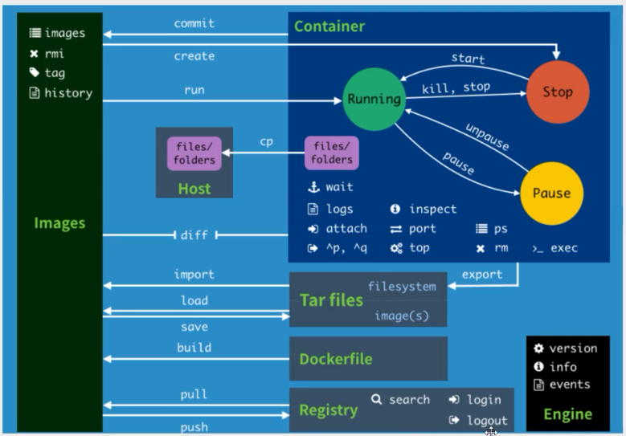

```shell
  attach      Attach to a running container 	      # 当前shell下attach连接指定运行的镜像
  build       Build an image from a Dockerfile        # 通过Dockerfile定制镜像
  commit      Create a new image from a container changes  #提交当前容器为新的镜像
  cp          Copy files/folders between a container and the local filesystem #从容器中拷贝指定文件或目录到宿主机中
  create      Create a new container 				  # 创建一个新的容器，同run,但不启动容器
  diff        Inspect changes to files or directories on a container's filesystem #查看docker容器的变化
  events      Get real time events from the server 	  # 从docker服务获取容器实时事件
  exec        Run a command in a running container    # 在已存在的容器上运行命令
  export      Export a container filesystem as a tar archive # 导出容器的内容流作为一个tar归档文件[对应import]
  history     Show the history of an image            # 展示一个镜像形成历史
  images      List images                             # 列出系统当前的镜像
  import      Import the contents from a tarball to create a filesystem image # 从tar包中的内容创建一个新的文件系统镜像[对应export]
  info        Display system-wide information         # 显示系统相关信息
  inspect     Return low-level information on Docker objects # 查看容器详细信息
  kill        Kill one or more running containers     # 杀死指定的docker容器
  load        Load an image from a tar archive or STDIN # 从一个tar包加载一个镜像[对应save]
  login       Log in to a Docker registry			  # 注册或者登录一个docker源服务器
  logout      Log out from a Docker registry		  # 从当前Docker registry退出
  logs        Fetch the logs of a container			  # 输出当前容器日志信息
  pause       Pause all processes within one or more containers 	     # 暂停容器
  port        List port mappings or a specific mapping for the container # 查看映射端口对应容器内部源端口
  ps          List containers						  # 列出容器列表
  pull        Pull an image or a repository from a registry # 从docker镜像源服务器拉取指定镜像或库镜像
  push        Push an image or a repository to a registry   # 推送指定镜像或者库镜像至docker源服务器
  rename      Rename a container					  # 给docker容器重新命名
  restart     Restart one or more containers		  # 重启运行的容器
  rm          Remove one or more containers			  # 移除一个或者多个容器
  rmi         Remove one or more images				  # 移除一个或者多个镜像[无容器使用该镜像时才可删除，否则需删除相关容器才可继续或 -f 强制删除]
  run         Run a command in a new container		  # 创建一个新的容器并运行一个命令
  save        Save one or more images to a tar archive (streamed to STDOUT by default) # 保存一个镜像为一个tar包[对应load]
  search      Search the Docker Hub for images		  # 在docker hub中搜索镜像
  start       Start one or more stopped containers	  # 启动容器
  stats       Display a live stream of container(s) resource usage statistics # 实时显示容器资源使用统计
  stop        Stop one or more running containers	  # 停止容器
  tag         Create a tag TARGET_IMAGE that refers to SOURCE_IMAGE # 给源中镜像打标签
  top         Display the running processes of a container   	  # 查看容器中运行的进程信息
  unpause     Unpause all processes within one or more containers # 取消暂停容器
  update      Update configuration of one or more containers	  # 更新一个或多个容器配置
  version     Show the Docker version information	  # 查看docker版本号 
  wait        Block until one or more containers stop, then print their exit codes # 截取容器停止时的退出状态值
```

## 作业练习

> 作业1：Docker 安装Nginx

```shell
# 1.搜索镜像 search 建议去docker搜索，可以看到帮助文档
# 2.下载镜像 pull
# 3.运行测试
[root@localhost /]# docker images
REPOSITORY          TAG                 IMAGE ID            CREATED             SIZE
nginx               latest              2622e6cca7eb        23 hours ago        132MB
centos              latest              470671670cac        4 months ago        237MB

# -d 后台运行
# --name 给容器命名
# -p 宿主机端口：容器内部端口   【端口映射操作】
[root@localhost /]# docker run -d --name nginx01 -p 3344:80 nginx
d60570d1e45024e3687e3bf3105a6959af8ee68d34f0c62a7deee1c16ec6579f
CONTAINER ID        IMAGE               COMMAND                  CREATED             STATUS              PORTS                  NAMES
d60570d1e450        nginx               "/docker-entrypoint.…"   2 minutes ago       Up 2 minutes        0.0.0.0:3344->80/tcp   nginx01
# 本地测试访问nginx
[root@localhost /]# curl localhost:3344

# 进入容器
[root@localhost /]# docker exec -it nginx01 /bin/bash
root@d60570d1e450:/# whereis nginx
nginx: /usr/sbin/nginx /usr/lib/nginx /etc/nginx /usr/share/nginx
root@d60570d1e450:/# cd /etc/nginx/
root@d60570d1e450:/etc/nginx# ls
conf.d	fastcgi_params	koi-utf  koi-win  mime.types  modules  nginx.conf  scgi_params	uwsgi_params  win-utf
```

**端口暴露的概念**

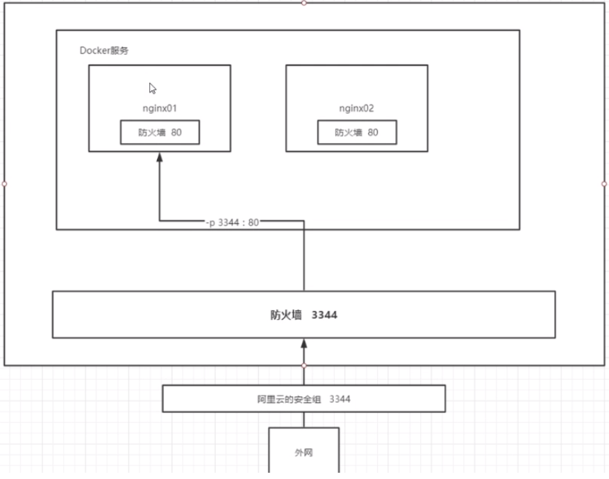

**思考问题：**我们每次改动nginx配置文件，都需要进入容器内部？十分麻烦，我要是可以在容器外部提供一个映射路径，达到在容器外部修改文件名，容器内部就可以自动修改？-v 数据卷 技术！


> 作业2：Docker来装一个tomcat

```shell
# 官方文档
docker run -it --rm tomcat:9.0

# 我们之前的启动都是后台，停止了容器之后，容器还是可以查到 docker run -it --rm,一般用来测试，用完就删除

# 下载再启动
docker pull tomcat

# 启动运行
docker run -d -p 3355:8080 --name tomcat01 tomcat

#测试访问没有问题


# 进入容器
[root@localhost /]# docker exec -it tomcat01 /bin/bash

# 发现问题：1、linux命令少了 2、webapps内没有内容（这是阿里云镜像的原因：默认是最小镜像，所有不必要的都删除）
# 保证最小可运行环境
#解决方法：将webapps.dist目录下内容拷至webapps下
root@c435d5b974a7:/usr/local/tomcat# cd webapps
root@c435d5b974a7:/usr/local/tomcat/webapps# ls
root@c435d5b974a7:/usr/local/tomcat/webapps# cd ..
root@c435d5b974a7:/usr/local/tomcat# ls
BUILDING.txt  CONTRIBUTING.md  LICENSE	NOTICE	README.md  RELEASE-NOTES  RUNNING.txt  bin  conf  lib  logs  native-jni-lib  temp  webapps  webapps.dist  work
root@c435d5b974a7:/usr/local/tomcat# cd webapps.dist/
root@c435d5b974a7:/usr/local/tomcat/webapps.dist# ls
ROOT  docs  examples  host-manager  manager
root@c435d5b974a7:/usr/local/tomcat/webapps.dist# cd ..
root@c435d5b974a7:/usr/local/tomcat# cp -r webapps.dist/* webapps 
root@c435d5b974a7:/usr/local/tomcat# cd webapps
root@c435d5b974a7:/usr/local/tomcat/webapps# ls
ROOT  docs  examples  host-manager  manager
```

拷贝完成就可以访问了：

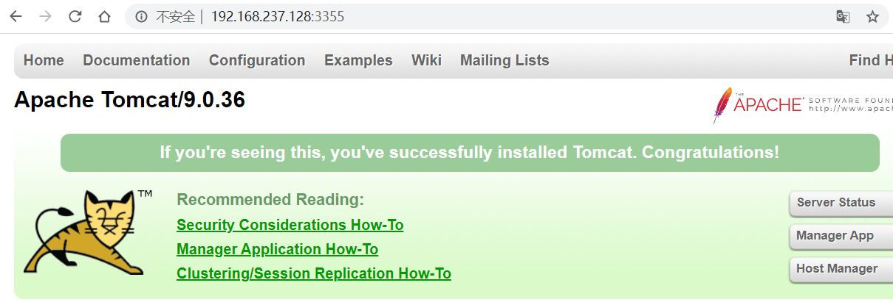

**思考问题：**我们以后要部署项目，如果每次都要进入容器是不是十分麻烦？我要是可以在容器外部提供映射路径，webapps,我们在外部放置项目，就自动同步到内部就好了！


> 作业3：部署es+kibana

```shell
# es 暴露的端口很多！
# es 十分耗内存
# es 的数据一般需要放置到安全目录！挂载
# --net somenetwork？网络配置

# 启动 elasticsearch
docker run -d --name elasticsearch -p 9200:9200 -p 9300:9300 -e "discovery.type=single-node" elasticsearch:7.6.2

# 启动了 Linux就可卡住了   docker stats 查看cpu的状态
# es 是十分耗内存的

# 测试一下es是否成功了
[root@localhost /]# curl localhost:9200
{
  "name" : "83b0d5dca26e",
  "cluster_name" : "docker-cluster",
  "cluster_uuid" : "MjhNfYTvRVui1UCrAwMdqw",
  "version" : {
    "number" : "7.6.2",
    "build_flavor" : "default",
    "build_type" : "docker",
    "build_hash" : "ef48eb35cf30adf4db14086e8aabd07ef6fb113f",
    "build_date" : "2020-03-26T06:34:37.794943Z",
    "build_snapshot" : false,
    "lucene_version" : "8.4.0",
    "minimum_wire_compatibility_version" : "6.8.0",
    "minimum_index_compatibility_version" : "6.0.0-beta1"
  },
  "tagline" : "You Know, for Search"
}

# 查看docker容器占用资源情况
```


```shell
# 赶紧关闭容器，增加内存限制，修改配置文件 -e 环境配置修改
docker run -d --name elasticsearch02 -p 9200:9200 -p 9300:9300 -e "discovery.type=single-node" -e ES_JAVA_OPTS="-Xms64m -Xmx512m" elasticsearch:7.6.2
 
 # 查看docker容器占用资源情况
```


```shell
[root@localhost /]# curl localhost:9200
{
  "name" : "5a262b522bbf",
  "cluster_name" : "docker-cluster",
  "cluster_uuid" : "rGMaCpVXScGaZcv_UtK3gQ",
  "version" : {
    "number" : "7.6.2",
    "build_flavor" : "default",
    "build_type" : "docker",
    "build_hash" : "ef48eb35cf30adf4db14086e8aabd07ef6fb113f",
    "build_date" : "2020-03-26T06:34:37.794943Z",
    "build_snapshot" : false,
    "lucene_version" : "8.4.0",
    "minimum_wire_compatibility_version" : "6.8.0",
    "minimum_index_compatibility_version" : "6.0.0-beta1"
  },
  "tagline" : "You Know, for Search"
}
```


> 作业4：使用 kibana 连接 es ? 思考网络如何才能连接过去！

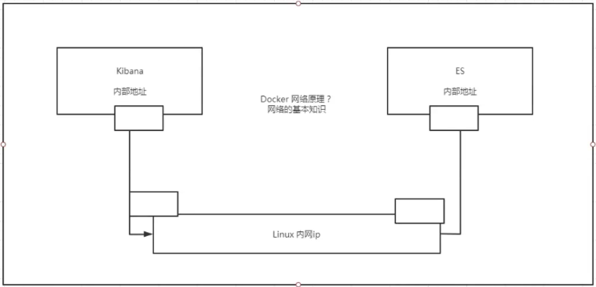

## 可视化

- portainer（线用这个）

```shell
docker run -d -p 8088:9000 \
--restart=always -v /var/run/docker.sock:/var/run/docker.sock --privileged=true portainer/portainer
```

- Rancher （CI/CD再用）

  

## 什么是portainer ?

Docker图形化界面管理工具！提供一个后台面板供我们操作！

```shell
docker run -d -p 8088:9000 \
--restart=always -v /var/run/docker.sock:/var/run/docker.sock --privileged=true portainer/portainer
```

外部访问测试：http://ip:8088/

通过它来访问了;

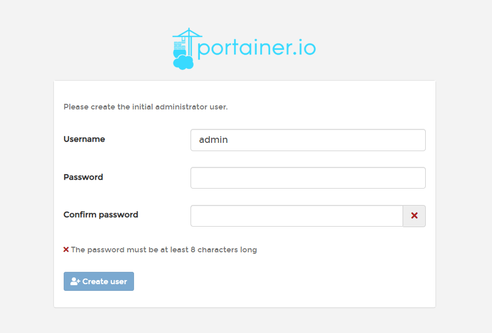

选择本地的：

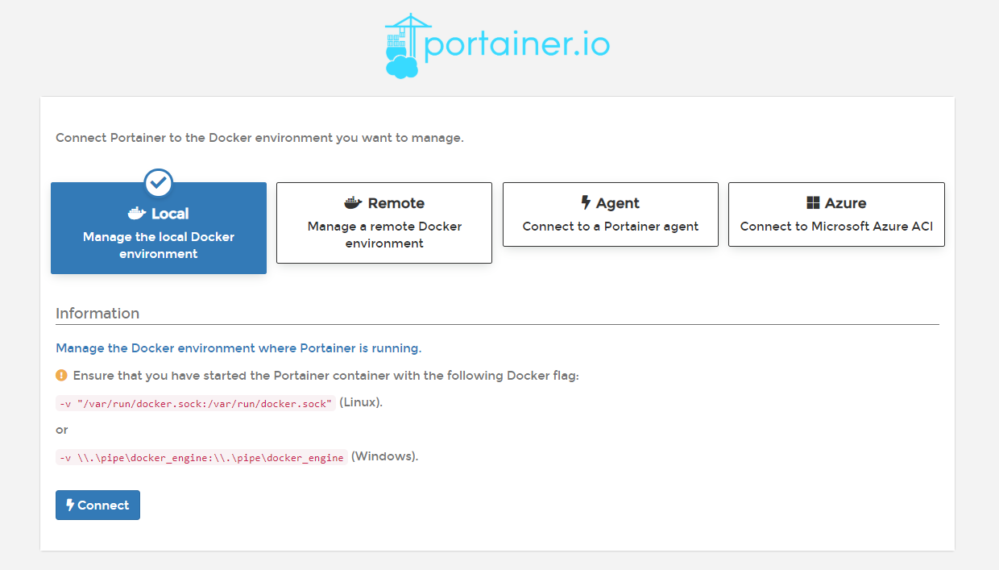

进入之后的面板：

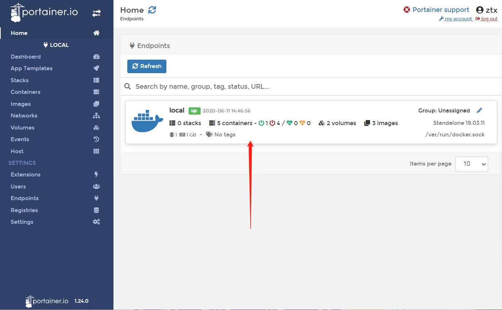


可视化面板我们平时不会使用，大家自己测试玩玩即可！


# Docker镜像讲解

## 镜像是什么

镜像是一种轻量级、可执行的独立软件保，用来打包软件运行环境和基于运行环境开发的软件，他包含运行某个软件所需的所有内容，包括代码、运行时库、环境变量和配置文件。

所有应用，直接打包docker镜像，就可以直接跑起来！

**如何得到镜像**

- 从远程仓库下载
- 别人拷贝给你
- 自己制作一个镜像 DockerFile

## Docker镜像加载原理

> UnionFs （联合文件系统）

UnionFs（联合文件系统）：Union文件系统（UnionFs）是一种分层、轻量级并且高性能的文件系统，他支持对文件系统的修改作为一次提交来一层层的叠加，同时可以将不同目录挂载到同一个虚拟文件系统下（ unite several directories into a single virtual filesystem)。Union文件系统是 Docker镜像的基础。镜像可以通过分层来进行继承，基于基础镜像（没有父镜像），可以制作各种具体的应用镜像

特性：一次同时加载多个文件系统，但从外面看起来，只能看到一个文件系统，联合加载会把各层文件系统叠加起来，这样最终的文件系统会包含所有底层的文件和目录。


> Docker镜像加载原理

docker的镜像实际上由一层一层的文件系统组成，这种层级的文件系统UnionFS。

boots(boot file system）主要包含 bootloader和 Kernel, bootloader主要是引导加载 kernel, Linux刚启动时会加载bootfs文件系统，在 Docker镜像的最底层是 boots。这一层与我们典型的Linux/Unix系统是一样的，包括bootloader和 Kernel。当boot加载完成之后整个内核就都在内存中了，此时内存的使用权已由 bootfs转交给内核，此时系统也会卸载bootfs。

rootfs（root file system),在 bootfs之上。包含的就是典型 Linux系统中的/dev,/proc,/bin,/etc等标准目录和文件。 rootfs就是各种不同的操作系统发行版，比如 Ubuntu, Centos等等。
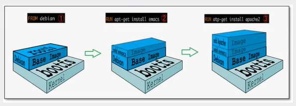

平时我们安装进虚拟机的CentOS都是好几个G，为什么Docker这里才200M？


对于个精简的OS, rootfs可以很小，只需要包合最基本的命令、工具和程序库就可以了，因为底层直接用Host的kernel，自己只需要提供rootfs就可以了。由此可见对于不同的Linux发行版， boots基本是一致的， rootfs会有差別，因此不同的发行版可以公用bootfs.

虚拟机是分钟级别，容器是秒级！

## 分层理解

> 分层的镜像

我们可以去下载一个镜像，注意观察下载的日志输出，可以看到是一层层的在下载！

**思考：为什么Docker镜像要采用这种分层的结构呢？**

最大的好处，我觉得莫过于资源共享了！比如有多个镜像都从相同的Base镜像构建而来，那么宿主机只需在磁盘上保留一份base镜像，同时内存中也只需要加载一份base镜像，这样就可以为所有的容器服务了，而且镜像的每一层都可以被共享。

查看镜像分层的方式可以通过docker image inspect 命令

```shell
➜  / docker image inspect redis          
[
    {
        "Id": "sha256:f9b9909726890b00d2098081642edf32e5211b7ab53563929a47f250bcdc1d7c",
        "RepoTags": [
            "redis:latest"
        ],
        "RepoDigests": [
            "redis@sha256:399a9b17b8522e24fbe2fd3b42474d4bb668d3994153c4b5d38c3dafd5903e32"
        ],
        "Parent": "",
        "Comment": "",
        "Created": "2020-05-02T01:40:19.112130797Z",
        "Container": "d30c0bcea88561bc5139821227d2199bb027eeba9083f90c701891b4affce3bc",
        "ContainerConfig": {
            "Hostname": "d30c0bcea885",
            "Domainname": "",
            "User": "",
            "AttachStdin": false,
            "AttachStdout": false,
            "AttachStderr": false,
            "ExposedPorts": {
                "6379/tcp": {}
            },
            "Tty": false,
            "OpenStdin": false,
            "StdinOnce": false,
            "Env": [
                "PATH=/usr/local/sbin:/usr/local/bin:/usr/sbin:/usr/bin:/sbin:/bin",
                "GOSU_VERSION=1.12",
                "REDIS_VERSION=6.0.1",
                "REDIS_DOWNLOAD_URL=http://download.redis.io/releases/redis-6.0.1.tar.gz",
                "REDIS_DOWNLOAD_SHA=b8756e430479edc162ba9c44dc89ac394316cd482f2dc6b91bcd5fe12593f273"
            ],
            "Cmd": [
                "/bin/sh",
                "-c",
                "#(nop) ",
                "CMD [\"redis-server\"]"
            ],
            "ArgsEscaped": true,
            "Image": "sha256:704c602fa36f41a6d2d08e49bd2319ccd6915418f545c838416318b3c29811e0",
            "Volumes": {
                "/data": {}
            },
            "WorkingDir": "/data",
            "Entrypoint": [
                "docker-entrypoint.sh"
            ],
            "OnBuild": null,
            "Labels": {}
        },
        "DockerVersion": "18.09.7",
        "Author": "",
        "Config": {
            "Hostname": "",
            "Domainname": "",
            "User": "",
            "AttachStdin": false,
            "AttachStdout": false,
            "AttachStderr": false,
            "ExposedPorts": {
                "6379/tcp": {}
            },
            "Tty": false,
            "OpenStdin": false,
            "StdinOnce": false,
            "Env": [
                "PATH=/usr/local/sbin:/usr/local/bin:/usr/sbin:/usr/bin:/sbin:/bin",
                "GOSU_VERSION=1.12",
                "REDIS_VERSION=6.0.1",
                "REDIS_DOWNLOAD_URL=http://download.redis.io/releases/redis-6.0.1.tar.gz",
                "REDIS_DOWNLOAD_SHA=b8756e430479edc162ba9c44dc89ac394316cd482f2dc6b91bcd5fe12593f273"
            ],
            "Cmd": [
                "redis-server"
            ],
            "ArgsEscaped": true,
            "Image": "sha256:704c602fa36f41a6d2d08e49bd2319ccd6915418f545c838416318b3c29811e0",
            "Volumes": {
                "/data": {}
            },
            "WorkingDir": "/data",
            "Entrypoint": [
                "docker-entrypoint.sh"
            ],
            "OnBuild": null,
            "Labels": null
        },
        "Architecture": "amd64",
        "Os": "linux",
        "Size": 104101893,
        "VirtualSize": 104101893,
        "GraphDriver": {
            "Data": {
                "LowerDir": "/var/lib/docker/overlay2/adea96bbe6518657dc2d4c6331a807eea70567144abda686588ef6c3bb0d778a/diff:/var/lib/docker/overlay2/66abd822d34dc6446e6bebe73721dfd1dc497c2c8063c43ffb8cf8140e2caeb6/diff:/var/lib/docker/overlay2/d19d24fb6a24801c5fa639c1d979d19f3f17196b3c6dde96d3b69cd2ad07ba8a/diff:/var/lib/docker/overlay2/a1e95aae5e09ca6df4f71b542c86c677b884f5280c1d3e3a1111b13644b221f9/diff:/var/lib/docker/overlay2/cd90f7a9cd0227c1db29ea992e889e4e6af057d9ab2835dd18a67a019c18bab4/diff",
                "MergedDir": "/var/lib/docker/overlay2/afa1de233453b60686a3847854624ef191d7bc317fb01e015b4f06671139fb11/merged",
                "UpperDir": "/var/lib/docker/overlay2/afa1de233453b60686a3847854624ef191d7bc317fb01e015b4f06671139fb11/diff",
                "WorkDir": "/var/lib/docker/overlay2/afa1de233453b60686a3847854624ef191d7bc317fb01e015b4f06671139fb11/work"
            },
            "Name": "overlay2"
        },
        "RootFS": {
            "Type": "layers",
            "Layers": [
                "sha256:c2adabaecedbda0af72b153c6499a0555f3a769d52370469d8f6bd6328af9b13",
                "sha256:744315296a49be711c312dfa1b3a80516116f78c437367ff0bc678da1123e990",
                "sha256:379ef5d5cb402a5538413d7285b21aa58a560882d15f1f553f7868dc4b66afa8",
                "sha256:d00fd460effb7b066760f97447c071492d471c5176d05b8af1751806a1f905f8",
                "sha256:4d0c196331523cfed7bf5bafd616ecb3855256838d850b6f3d5fba911f6c4123",
                "sha256:98b4a6242af2536383425ba2d6de033a510e049d9ca07ff501b95052da76e894"
            ]
        },
        "Metadata": {
            "LastTagTime": "0001-01-01T00:00:00Z"
        }
    }
]
```

**理解：**

所有的 Docker镜像都起始于一个基础镜像层，当进行修改或培加新的内容时，就会在当前镜像层之上，创建新的镜像层。

举一个简单的例子，假如基于 Ubuntu Linux16.04创建一个新的镜像，这就是新镜像的第一层；如果在该镜像中添加 Python包，就会在基础镜像层之上创建第二个镜像层；如果继续添加一个安全补丁，就会创建第三个镜像层。

该镜像当前已经包含3个镜像层，如下图所示（这只是一个用于演示的很简单的例子）。

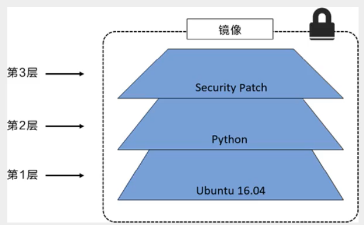

在添加额外的镜像层的同时，镜像始终保持是当前所有镜像的组合，理解这一点非常重要。下图中举了一个简单的例子，每个镜像层包含3个文件，而整体的大镜像包含了来自两个镜像层的6个文件。

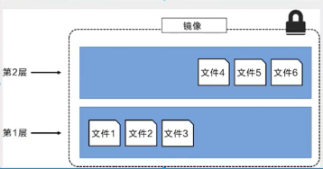

上图中的镜像层跟之前图中的略有区別，主要目的是便于展示文件。

下图中展示了一个稍微复杂的三层镜像，在外部看来整个镜像只有6个文件，这是因为最上层中的文件7是文件5的一个更新版。

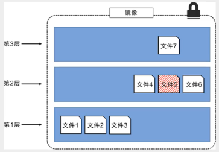

这种情況下，上层镜像层中的文件覆盖了底层镜像层中的文件。这样就使得文件的更新版本作为一个新镜像层添加到镜像当中。

Docker通过存储引擎（新版本采用快照机制）的方式来实现镜像层堆栈，并保证多镜像层对外展示为统一的文件系统。

Linux上可用的存储引撃有AUFS、 Overlay2、 Device Mapper、Btrfs以及ZFS。顾名思义，每种存储引擎都基于 Linux中对应的文件系统或者块设备技术，井且每种存储引擎都有其独有的性能特点。

Docker在 Windows上仅支持 windowsfilter 一种存储引擎，该引擎基于NTFS文件系统之上实现了分层和CoW [1]。


> 特点

Docker 镜像都是只读的，当容器启动时，一个新的可写层加载到镜像的顶部！

这一层就是我们通常说的容器层，容器之下的都叫镜像层！


如何提交一个自己的镜像？

## commit镜像

```shell
docker commit 提交容器成为一个新的副本

# 命令和git原理类似
docker commit -m="描述信息" -a="作者" 容器id 目标镜像名:[版本TAG]
```

实战测试

```shell
#1、启动一个默认的tomcat

#2、发现这个默认的tomcat是没有webapps应用的，镜像的原因。官方的镜像默认webapps下面是没有文件的！

#3、我自己将webapp.dist下文件拷贝至webapps下

#4、将我们操作过的容器通过commit提交为一个镜像！我们以后就可以使用我们修改过的镜像了，这就是我们自己的一个修改的镜像
```


```shell
如果你想要保存当前容器的状态，就可以通过commit来提交，获得一个镜像，就好比我们我们使用虚拟机的快照。
```

到了这里就算是入门Docker了！

